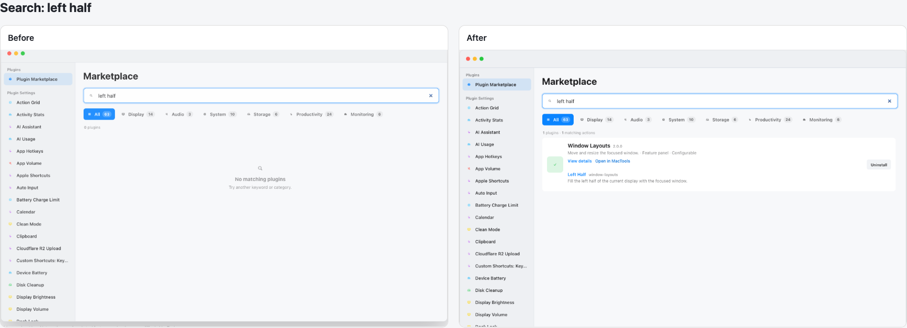
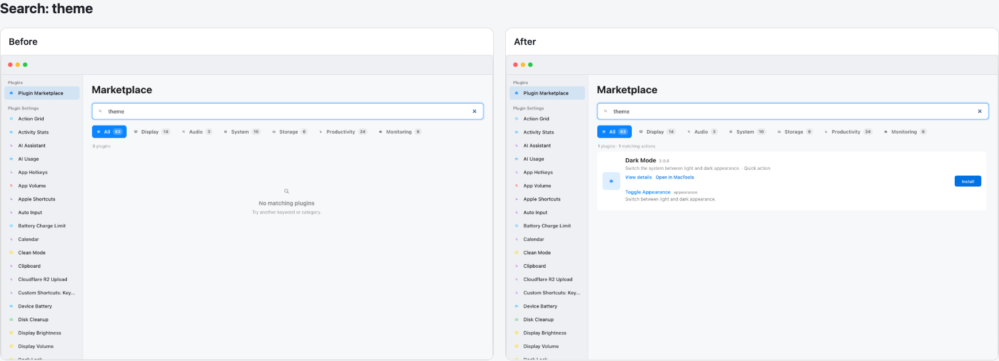
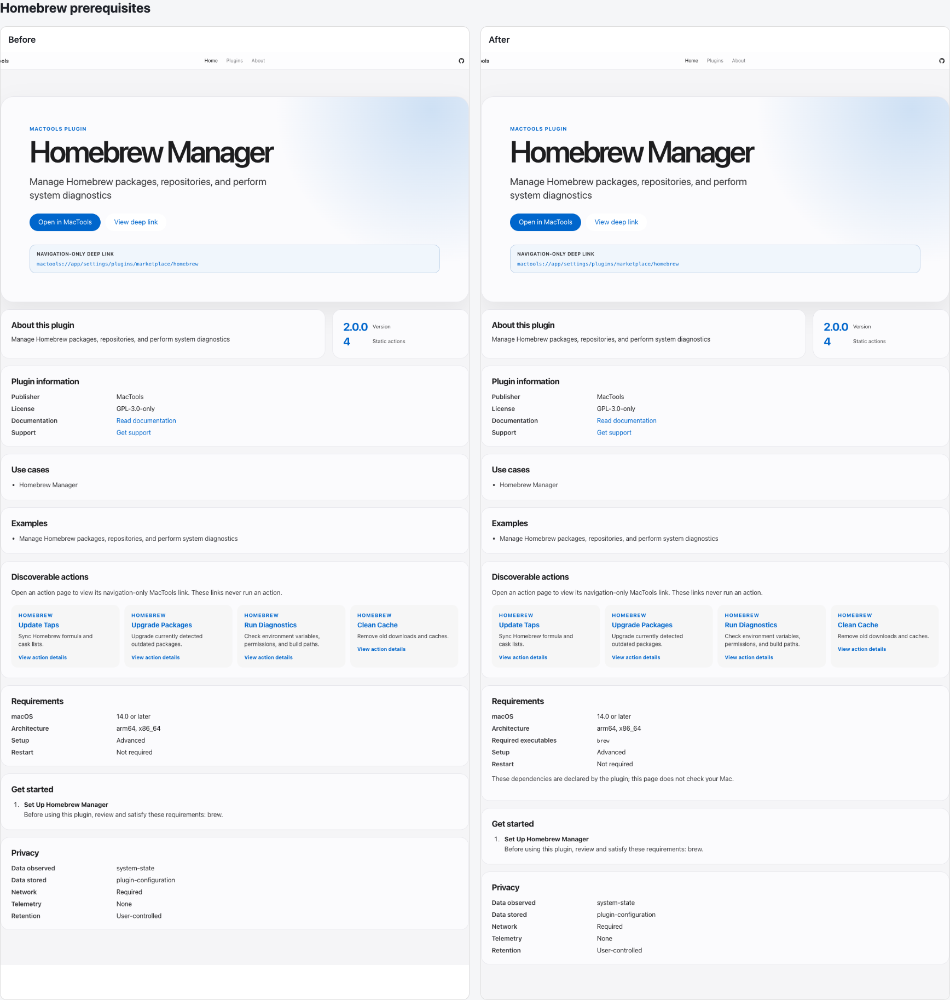
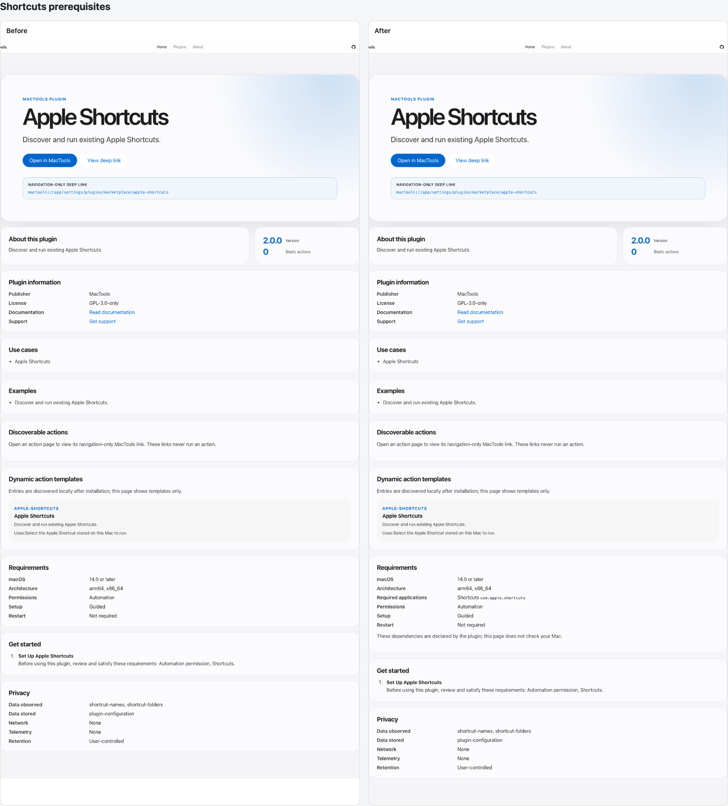
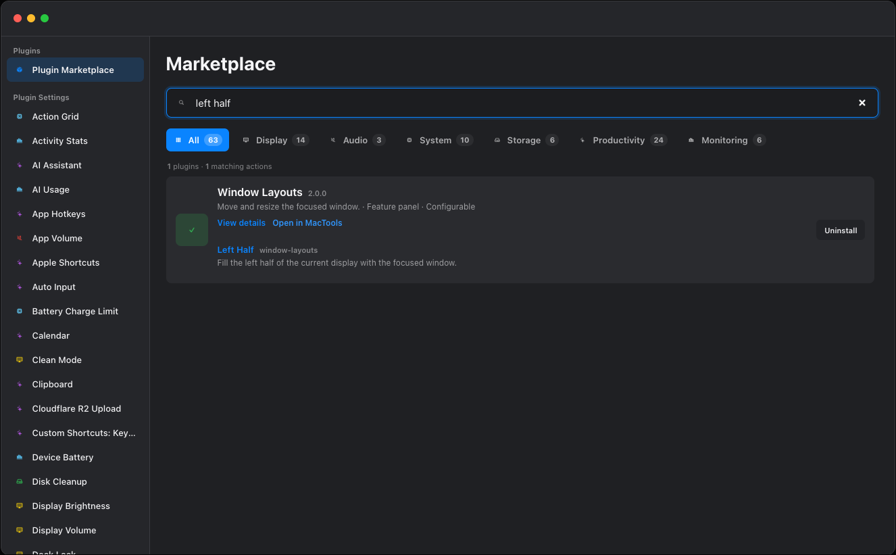
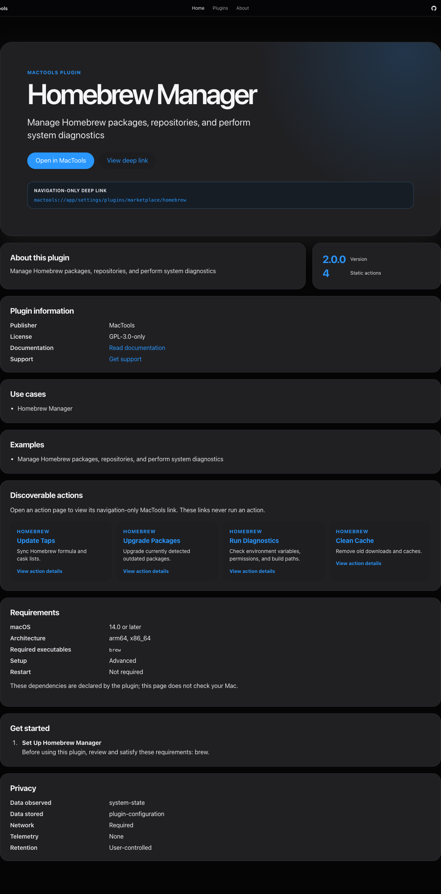
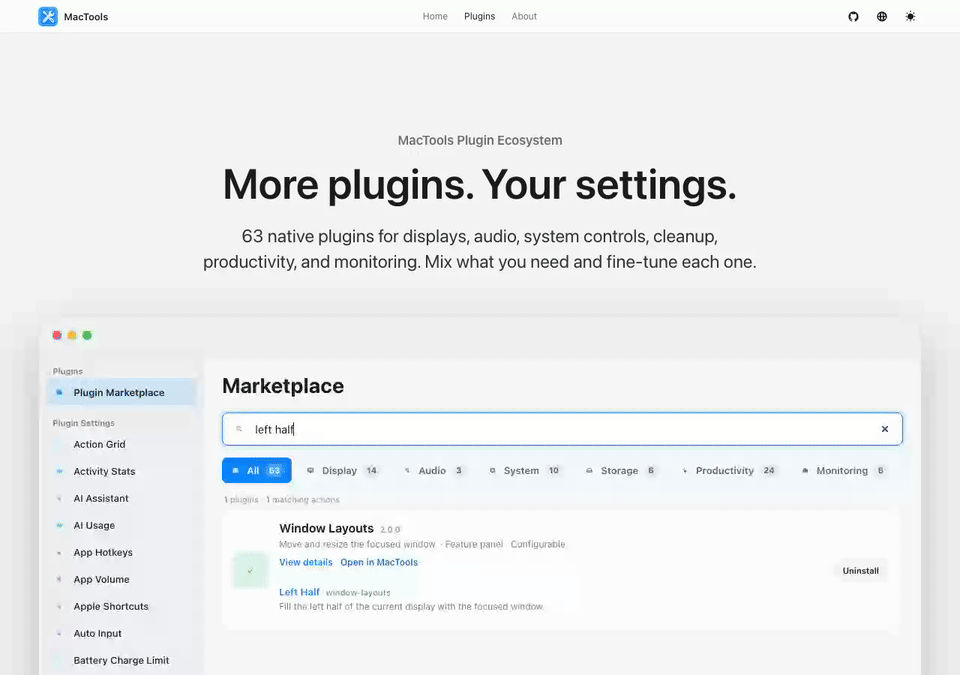

# Issue 472 website comparison

Captured from the local static website before and after the capability-search and
prerequisite-disclosure change. The baseline is commit
`d914bfbeccbd6806cd27c88a456a890cdcb6e9bd`. These captures show website navigation
and declared metadata; they do not execute MacTools actions or inspect a visitor's
installed applications.

| Task | Before | After |
| --- | --- | --- |
| Search `left half` or `左半屏` | No results | Window Layouts and its Left Half action |
| Search `pause clipboard history` | No results | Clipboard and its Pause Clipboard History action |
| Search `theme` | No results | Dark Mode |
| Read Homebrew Manager requirements | Executable omitted | Declared `brew` requirement |
| Read Apple Shortcuts requirements | Application omitted | Shortcuts and `com.apple.shortcuts` |

## Light appearance

## Dark appearance

## Interaction

The recording shows task searches, expanding and collapsing the 40 matching
Window Layouts actions, switching to Chinese, and clearing the query to restore
ordinary browsing.

## Validation

- Focused search/controller/rendered-page checks: 4 passed.
- Website tests: 8 passed.
- Generated manifest-data freshness check passed.
- Static build: 202 pages, no errors or warnings; one existing TypeScript
  deprecation hint in the control-test harness.
- Chromium and WebKit checks passed for English/Chinese task discovery, category
  filters, counts including collapsed actions, disclosure reset, clear/empty
  states, keyboard focus, action-to-plugin navigation, and prerequisite rows.
- `git diff --check` passed.
