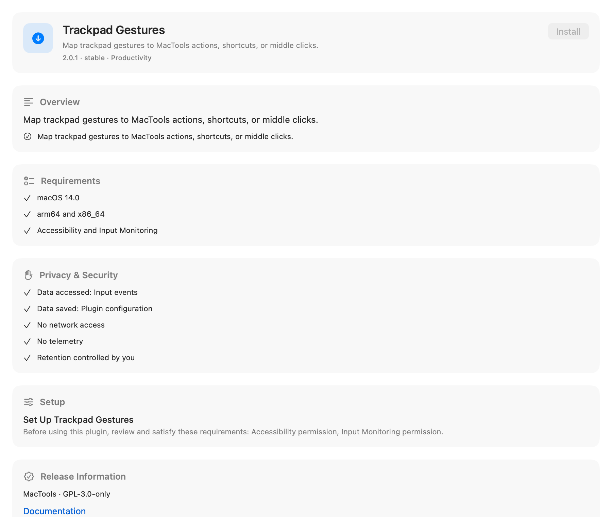
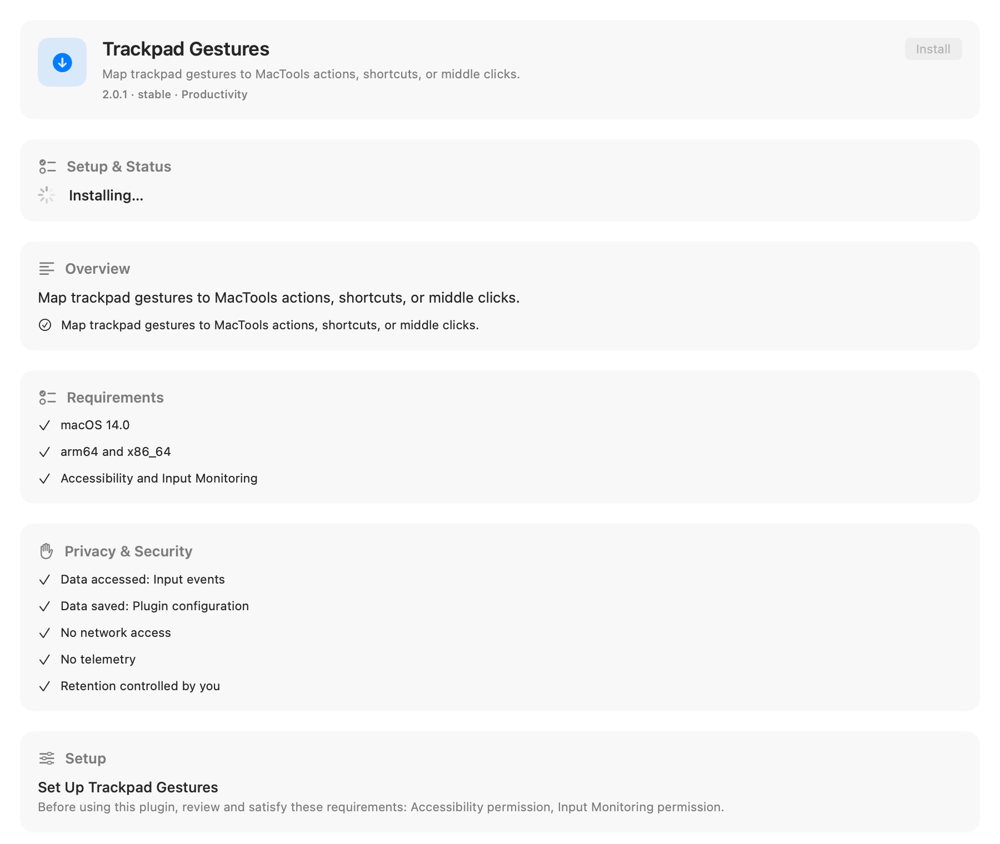
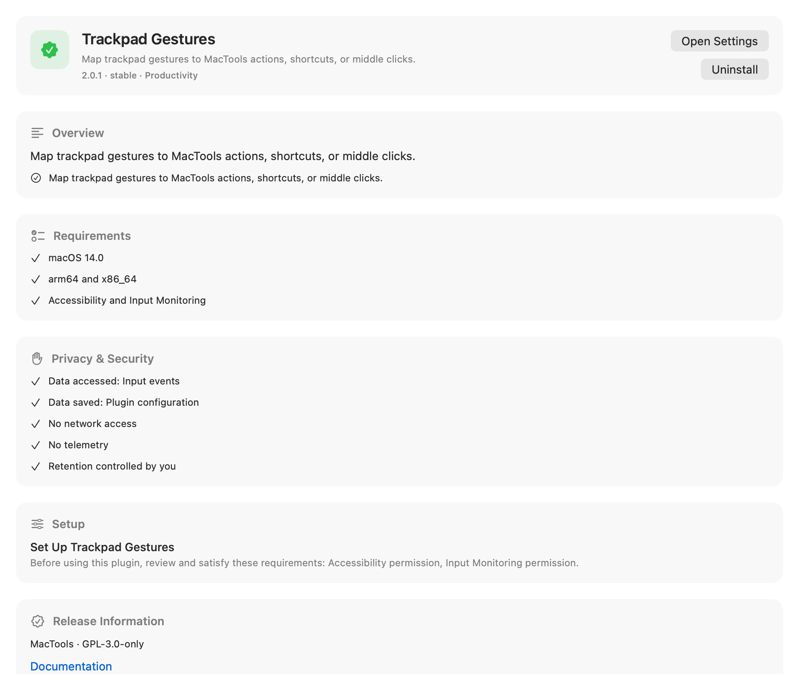
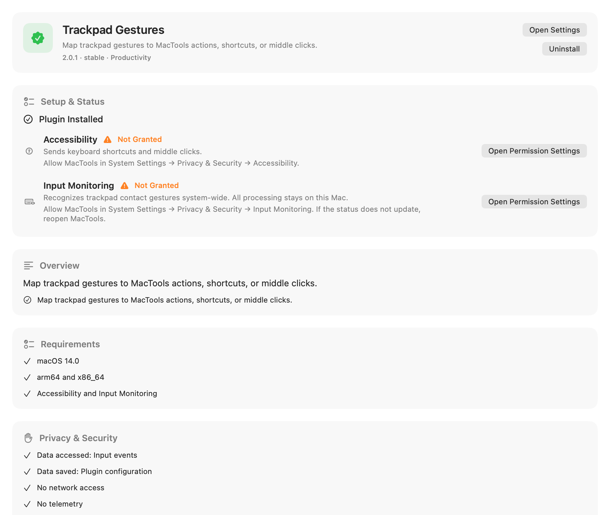

# Marketplace installation guidance — issue #471

This comparison covers the agreed scope of [issue #471](https://github.com/mactools-app/MacTools/issues/471): installation feedback, actionable setup guidance, and direct Search navigation. Runtime action inventories and explicit action testing remain follow-ups.

The screenshots are native SwiftUI/AppKit captures of the production Marketplace detail view. A separate capture app supplies deterministic Trackpad Gestures installation and permission states. Both versions use the same English metadata, light appearance, and viewport. The before version comes from main at `5c3b4ad6`; the after version captures the original implementation at `3b0cfdf0`. Later operation-lifetime and startup-state fixes preserve the pictured installation-in-progress and installed/loaded permission states. The images have not been rerendered for those fixes. These captures show the detail view's appearance; they do not establish live installation, permission grants, keyboard navigation, or VoiceOver behavior.

## Installation in progress

The before view disables Install while the operation runs. The after view also displays an explicit progress indicator and Installing status.

| Before | After |
| --- | --- |
|  |  |

## Installed plugin with missing permissions

The before view offers settings and catalog setup instructions. The after view confirms installation and shows the current missing Accessibility and Input Monitoring permissions with their existing action buttons.

| Before | After |
| --- | --- |
|  |  |

The capture app disables installation, permission, and settings side effects. Source hashes, fixture states, and capture details are recorded in [the evidence file](assets/issue-471/evidence.json). The [capture source archive](assets/issue-471/capture-harness-source.zip) preserves the exact views and fixture harness from the original capture revisions; its helper scripts use paths from the capture machine. Those recorded hashes remain unchanged and do not identify the later patched sources.

Search now opens the matching Marketplace detail directly. Static capability discovery preserves the provider/action highlight, dynamic capability discovery opens the plugin detail, and existing executable commands and installed settings keep their destinations. This behavior is covered by the focused Search and navigation tests.

## Validation

Four regression tests cover stale operation success/failure, duplicate-install protection, and startup preparation. All 28 focused tests passed, and follow-up independent subagent review found no remaining actionable issues. `make ci` passed: 2,728 XCTest tests passed, 4 opt-in Window Switcher desktop checks skipped, and all 229 script tests passed. PluginKit v7 binary compatibility, changelog validation, and strict localization validation passed. All 11 new copy entries cover the 12 supported languages.
